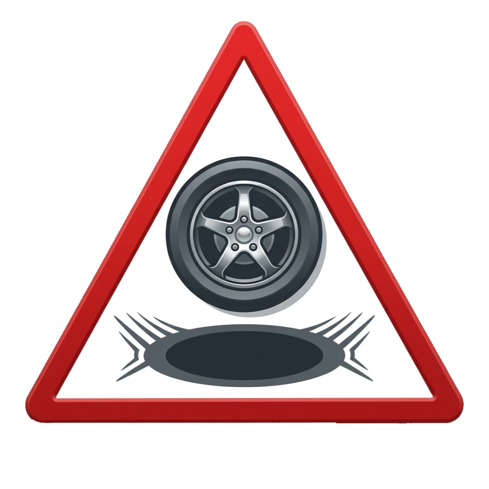
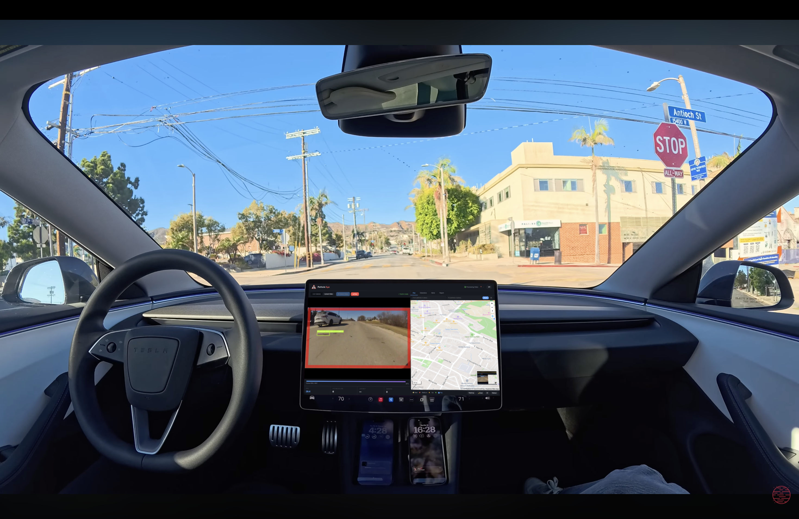
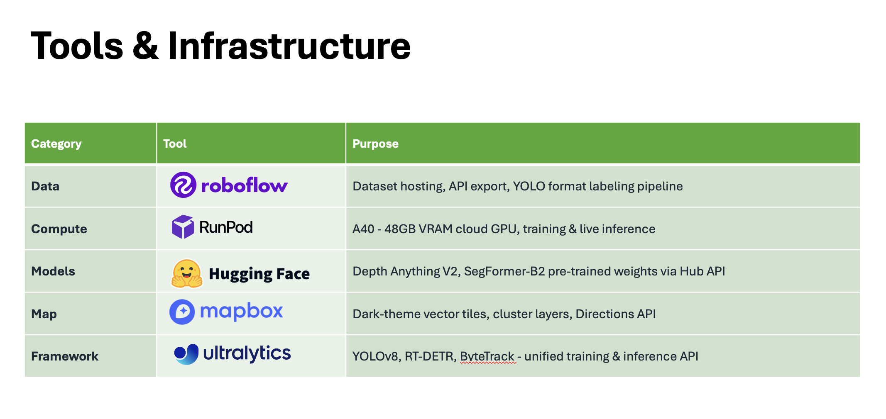
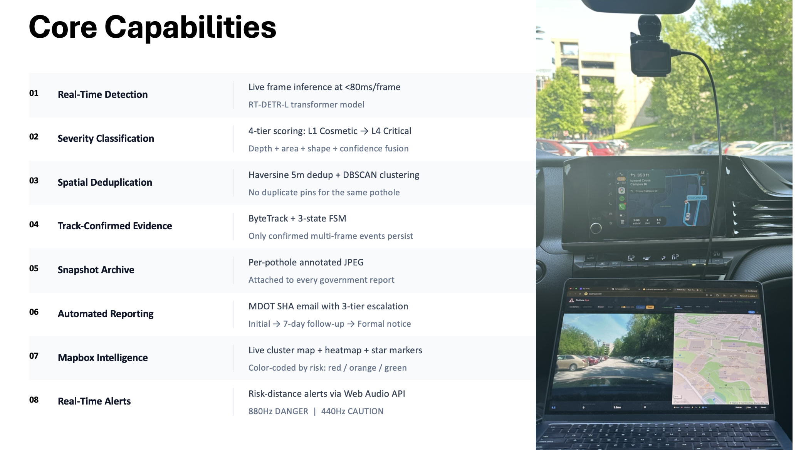
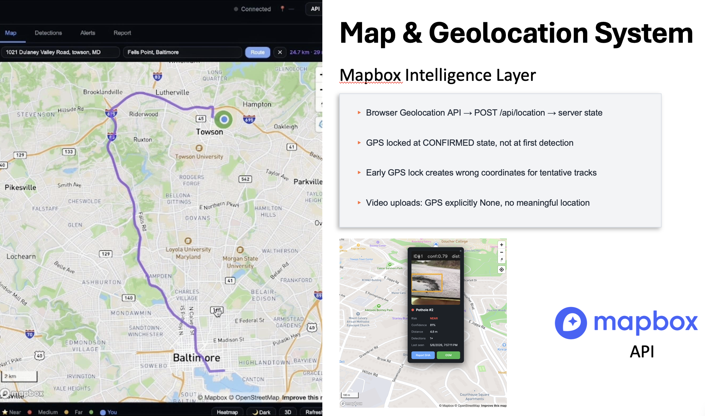
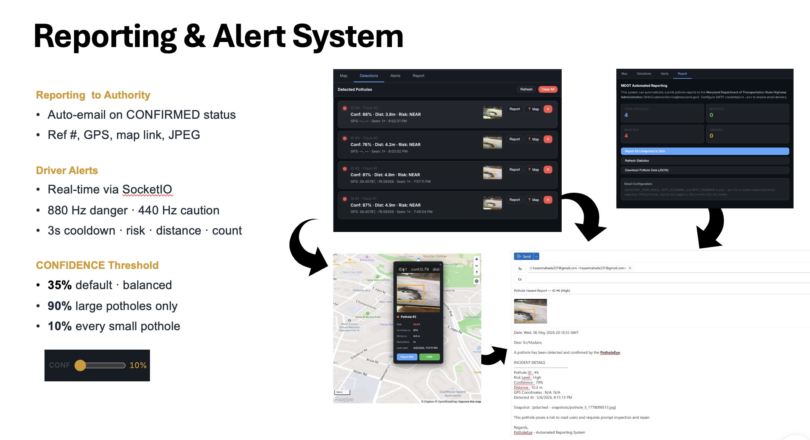
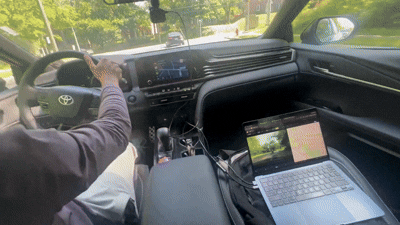
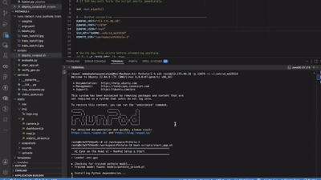
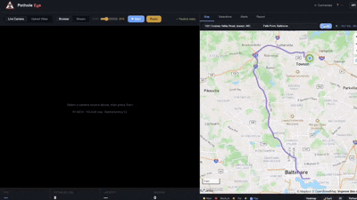

  

# Pothole Eye — Real-time pothole detection and alerting system

**Real-time pothole detection, tracking, and automated reporting powered by YOLOv8 + RT-DETR on GPU.**

> Deployed on RunPod GPUs · CUDA FP16 · Flask + SocketIO · Mapbox GL JS · MediaMTX WebRTC

---

## Overview

Pothole Eye processes live dashcam footage or uploaded video to:

1. **Detect** potholes using a custom-trained YOLOv8m model (mAP50 = 0.729) with RT-DETR-L as an optional primary detector
2. **Segment** the road surface (YOLOv8l-seg → SegFormer → DeepLabV3 fallback chain) to eliminate false positives on sky, buildings, and vegetation
3. **Estimate depth** (Depth Anything V2 Metric → MiDaS → geometric fallback) for real-world severity scoring
4. **Track** detections across frames using ByteTrack with a 4-state FSM gating (TENTATIVE → CONFIRMED → MATURE → ARCHIVED)
5. **Deduplicate** spatially using 5m Haversine distance to avoid repeat DB entries for the same pothole
6. **Alert** the driver in real time with Web Audio tones and visual overlays
7. **Report** confirmed potholes to the Maryland SHA automatically by email with GPS, snapshot, and 3-tier escalation

---

---

---

---

___

## REST API Reference

| Method | Endpoint | Description |
|--------|----------|-------------|
| GET | `/api/potholes` | List potholes (`?limit=N&format=flat\|full`) |
| GET | `/api/potholes/<id>` | Single pothole detail |
| DELETE | `/api/potholes/<id>` | Delete record |
| PATCH | `/api/potholes/<id>/location` | Assign GPS to ungeotagged pothole |
| POST | `/api/potholes/<id>/report` | Submit initial MDOT report |
| POST | `/api/potholes/<id>/personal-report` | Send personal email alert |
| GET | `/api/potholes/<id>/report-preview` | Preview report text |
| POST | `/api/potholes/<id>/mark-crossed` | Mark pothole as crossed |
| GET | `/api/map-data` | GeoJSON FeatureCollection (Mapbox source) |
| GET | `/api/mapbox-token` | Serve Mapbox token securely from env |
| GET | `/api/stats` | Detection statistics (total, severity breakdown) |
| GET | `/api/alerts` | Recent alert history (last 20) |
| GET | `/api/gps-status` | GPS source, coordinates, camera mode |
| GET | `/api/performance` | CPU / memory / thread metrics |
| GET | `/api/health` | Liveness check |
| GET | `/api/jobs/<job_id>/progress` | Video upload job progress |

---

---

---

---

## Performance

**RunPod A40 (48 GB VRAM), CUDA FP16:**

| Stage | Latency |
|---|---|
| YOLOv8m detection | ~12 ms/frame |
| YOLOv8l-seg segmentation | ~22 ms/frame |
| Depth Anything V2 | ~35 ms/frame |
| Full pipeline (all models active) | < 80 ms/frame (~13 FPS) |
| SocketIO frame delivery | < 50 ms end-to-end |
| WebRTC live stream latency | 200–400 ms |

**Model metrics (validation split):**

| Metric | Value |
|---|---|
| mAP50 | 0.729 |
| Precision | 0.742 |
| Recall | 0.676 |
| Training config | YOLOv8m · imgsz=1280 · 150 epochs · A40 AMP FP16 |

*Built with YOLOv8 · RT-DETR · Depth Anything V2 · ByteTrack · SegFormer · Flask · Mapbox GL JS · MediaMTX*
